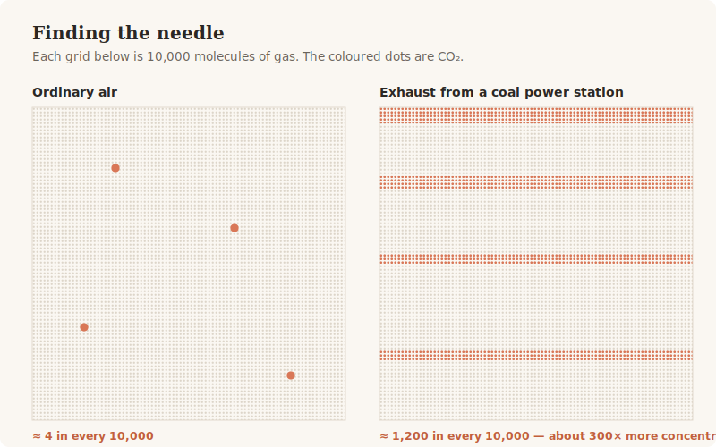
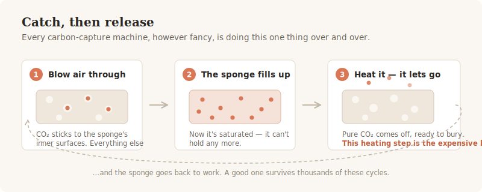

# Can we really suck carbon out of the sky?

There is a machine in Iceland, spread across a lava field, whose entire job is to pull carbon dioxide out of thin air. It is called Mammoth. It was built to remove 36,000 tonnes of CO₂ a year.

In 2024, it removed about **105 tonnes**.

That is not a typo, and it is the right place to start — because the gap between those two numbers is the real story of carbon capture. The chemistry works. The machines run. And the results, so far, are humbling. Here is why.

<!-- more -->

## Start with the needle

Carbon dioxide is famous, powerful, and — this is the crux — **incredibly rare**.

In the air around you right now, roughly **four molecules in every ten thousand** are CO₂. That is all. Everything else is nitrogen, oxygen, and odds and ends. Those four molecules are enough to warm a planet, because CO₂ traps heat extraordinarily well. But they are still four in ten thousand.

Now compare that with the exhaust pouring out of a coal power station, where around **1,200 in every ten thousand** are CO₂.

Sit with those two pictures for a moment, because they explain almost everything that follows — the costs, the arguments, the failures.

Catching something that makes up 12% of a gas stream is a chemistry problem. Catching something that makes up 0.04% of the open air is a *needle-in-a-haystack* problem. You must push an enormous volume of air past your equipment simply to find enough CO₂ to be worth the trouble. Physics charges you for that, and the bill is paid in energy.

Which is why you should be wary whenever someone talks about "carbon capture" as a single thing. There are really two:

- **Catching it at the chimney**, where it is concentrated. Difficult, but a working industrial technology.
- **Catching it from the open air**, where it is not. A far harder problem, still unsolved in economic terms.

Blurring those two together is how a great deal of nonsense gets sold.

## How you actually catch it

Strip away the engineering and every capture system on Earth does the same simple thing: **it grabs CO₂, then lets it go somewhere useful.**

The grabbing is done by a material — sometimes a liquid, sometimes a solid — that CO₂ sticks to. Picture a sponge, but a molecular one: riddled with holes so fine that the hidden surface area inside a single teaspoon can rival a tennis court. Line those inner surfaces with a chemistry that CO₂ likes to bond with, and air passing through leaves its carbon dioxide behind.

Then you have to get it back out. Usually you heat the sponge. The bonds break, pure CO₂ streams off, and the sponge is ready to work again.

That heating step is where the money goes. It is also where the whole field lives or dies — because **you have to do it again, and again, and again.**

A sponge that performs brilliantly once is worthless. A sponge that still works on its ten-thousandth cycle, in humid, dirty, real-world air, is worth a fortune.

Most don't. They crumble. Their chemistry degrades. Water clogs the pores. Sulphur compounds in flue gas poison them. Building a material that *survives* is the actual scientific challenge — not building one that captures CO₂ in the first place, which is comparatively easy. Reviews of the field keep circling the same three villains: energy cost, material stability, and scale.[^1][^2]

## The sponge that likes rain

Here is my favourite recent result, because it broke a rule everyone thought was fixed.

Water has always been the enemy of these materials. Humid air fouls the pores, competes for the binding sites, and wrecks performance. Every designer has fought it.

Then in 2024, a team at Berkeley published a material called **COF-999** — a crystalline framework built from some of the strongest bonds in chemistry, with flexible chemical "arms" grown inside its pores to grab passing CO₂ molecules.[^3]

It captured CO₂ straight from open air. It survived 100 rounds of catch-and-release without measurable decline. And, remarkably, **it worked roughly twice as well in humid air as in dry air.** The water, instead of poisoning it, joined in and helped.

They piped in the ordinary outdoor air of Berkeley and let it run. It cleaned the CO₂ out.

That is what real progress looks like here: not a bigger number, but a broken rule.

## The reality check

So if the chemistry is this good, why did Mammoth capture 105 tonnes instead of 36,000?

Because a brilliant material is not a working plant. Plants have downtime. Fans fail. Filters lose material. Weather interferes. And crucially, **you must subtract the emissions from building and running the thing** before you can claim any of it as a removal.

The numbers are sobering:

- Removing a tonne of CO₂ from the air has been costing somewhere around **$800–1,000**. The price at which it becomes economically sane is about **$100**.
- Every carbon capture project on Earth, added together since 1996, has stored roughly **380 million tonnes** of CO₂.[^4]
- Humanity emits about **37 billion tonnes every year**.

Do that division and it is bracing: **thirty years of global carbon capture equals roughly four days of global emissions.**

## So is it worthless?

No — and here is where both the cheerleaders and the cynics get it wrong.

**Catching carbon at the chimney is real and working.** The number of operating projects jumped 54% in a single year, from 50 to 77, with dozens more under construction.[^4] For industries like cement and steel — where the CO₂ comes from the chemistry itself, not merely from burning fuel, and so cannot be fixed by plugging into renewable electricity — this is one of the very few tools that exists.[^1] It deserves the investment.

**Catching carbon from the open air is not yet a climate solution.** It is a promising technology in an awkward adolescence: expensive, underperforming, and marketed with more confidence than the results justify. It may well become important. It is not important yet.

And the deepest point is the one most people would rather skip: **capture is not a substitute for not emitting.** If you burn fossil fuel to power a machine that removes carbon from the air, you have built an extraordinarily expensive treadmill. Direct air capture only makes sense on genuinely clean energy — and if you have clean energy going spare, there is usually something better to do with it first.

The honest role for these machines is as a **mop, not a tap**: something to clean up the emissions we truly cannot prevent, and eventually to draw down a little of what is already up there.

A mop is a good thing to own. It is not a reason to keep spilling.

## What's worth watching

The interesting question is no longer *can we capture CO₂*. We can, and have for decades.

It is whether anyone can build a material that keeps doing it — cheaply, for years, in filthy real-world air. Newer approaches are trying to sidestep the heating step altogether, using electricity to swing the chemistry back and forth instead of temperature; promising on paper, unproven at scale.[^2]

That is a materials science problem. And it will be solved, if it is solved, by people quietly testing the five-hundredth cycle rather than announcing the first.

---

## References

[^1]: Tan, J. Z. Y., Uratani, J. M., Griffiths, S., Andresen, J. M. & Maroto-Valer, M. M. **Chemistry advances driving industrial carbon capture technologies.** *Nature Reviews Chemistry* **9**, 656–671 (2025). [doi.org/10.1038/s41570-025-00733-3](https://doi.org/10.1038/s41570-025-00733-3)

[^2]: Hadi, A. I., Yan, A., Hu, Y., Lin, B., Zhou, T., Ouyang, D. & Tang, J. **A comprehensive review of carbon capture: from conventional to emerging electrochemical technologies.** *Next Energy* **9**, 100415 (2025). [doi.org/10.1016/j.nxener.2025.100415](https://doi.org/10.1016/j.nxener.2025.100415)

[^3]: Zhou, Z. *et al.* & Yaghi, O. M. **Carbon dioxide capture from open air using covalent organic frameworks.** *Nature* **635**, 96–101 (2024). [doi.org/10.1038/s41586-024-08080-x](https://doi.org/10.1038/s41586-024-08080-x)

[^4]: Global CCS Institute, **Global Status of CCS 2025: Staying the Course** (2025). See also Seyyedattar, M. & Zendehboudi, S. **Carbon capture and storage: a comprehensive review on current trends, techniques, and future prospects in North America.** *Fuel* **407**, 137276 (2026). [doi.org/10.1016/j.fuel.2025.137276](https://doi.org/10.1016/j.fuel.2025.137276)

*Figures are my own, drawn from data in the sources above.*
