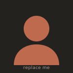

---
hide:
  - navigation
  - toc
---

# Yeasin Tarek

PhD Researcher · Materials Science

I'm a PhD researcher in Mechanical & Mining Engineering at the University of Queensland,
with a background in materials science, chemistry, and advanced characterization. My work
centers on superconducting joint technology — material synthesis and lab-scale process
development for the MRI industry — and I'm broadly interested in magnetic and
energy-storage materials for industrial applications.

Superconductivity
Energy Storage
Advanced Characterization
nano Materials
Machine Learning

[Read my research](research.md){ .md-button .md-button--primary }
[View publications](publications.md){ .md-button }

---

## About

I'm a PhD candidate in the Department of Mechanical & Mining Engineering at **The
University of Queensland** (since 2022), following an MSc in Chemistry from BUET and a
BSc in Chemistry from Khulna University. I combine materials synthesis with a broad
characterisation toolkit to develop and understand functional materials.

My current research focuses on **superconducting joint technology** — synthesizing
materials and developing laboratory-scale processes aimed at the MRI industry. Alongside
this, I'm interested in **magnetic and energy-storage materials**, including the battery
materials I worked on earlier in my career.

## Currently

- 🔬 Devoloping the superconducting MgB2 joints technology for an MRI industry
- 🧪 Devoloping a machine learning (ML)-driven study on the high entropy superconductor
- ⚡ Exploring the possibility of conducting an inverse design for existing ML studies

## Get in touch

The fastest way to reach me is by [email](contact.md). I'm open to collaborations,
questions about my work, and research discussions.
