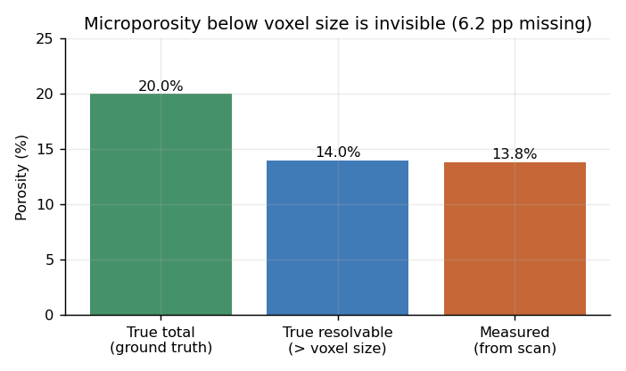
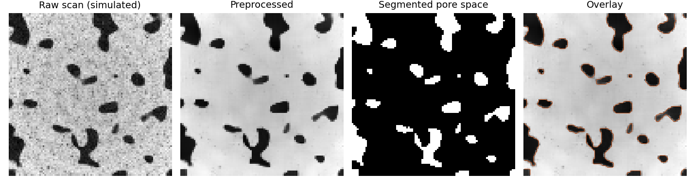
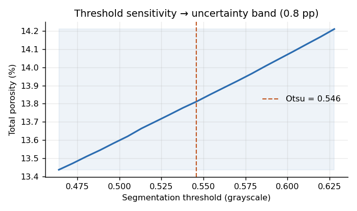
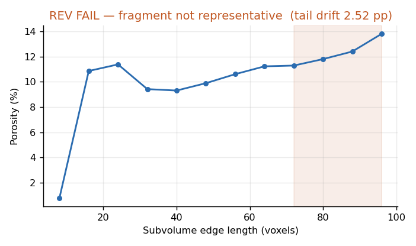
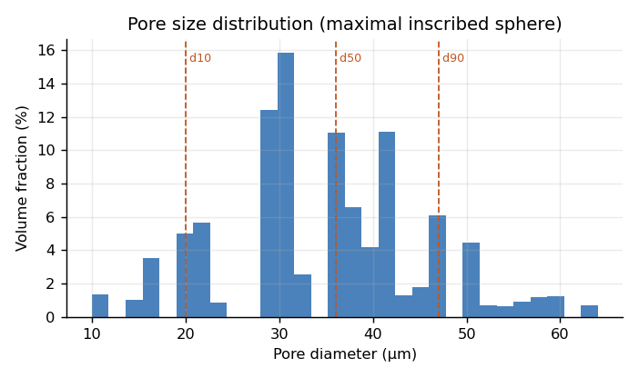

---
hide:
  - toc
---

# Micro-CT Porosity Analysis

Quantifying pore structure from micro-CT is straightforward. Quantifying it
*defensibly* — with a stated uncertainty and a known resolution limit — is not.
This pipeline does the second thing.

---

## Validation against known ground truth

On synthetic media where true porosity is exact by construction, the pipeline
recovers **20.00%** against a true **20.00%** when the pore structure is resolved.
The preprocessing chain (beam-hardening correction → ring removal → NLM denoise)
reduces absolute error monotonically: 0.08 → 0.06 → 0.02 → 0.00 pp. Each step
helps, but Otsu is fairly robust to these artefacts at this noise level — the
gains are real but modest.

---

## Where micro-CT porosity goes wrong

On a two-scale medium — coarse pores plus a sub-voxel population — true total
porosity is **20.0%**, but the measurement returns **13.8%**. The **6.2 pp deficit**
is not noise: the measured value lands almost exactly on the *resolvable* porosity
of 14.0%. Everything below voxel size is invisible to segmentation.

Reported porosity from cuttings is therefore a lower bound, and the gap is
largest in clay-rich and carbonate samples. This is not a pipeline artefact — it
emerges from the physics of partial-volume averaging, reproduced here by building
a two-population medium at high resolution and block-averaging 3×.

---

## Uncertainty, not a single number

Sweeping the segmentation threshold ±15% around Otsu moves porosity across a
**0.78 pp band**. That band is reported alongside every value. A porosity number
without a stated uncertainty is not a measurement.

---

## Is the fragment even representative?

Porosity computed on nested subvolumes has not stabilised by full fragment size —
**2.52 pp drift** across the largest subvolumes. This fragment **fails the REV test**,
meaning per-fragment properties should not be extrapolated to the formation.

Many real cuttings fragments will fail this. Knowing which ones is the point.

---

## Pore size distribution

Maximal inscribed sphere method. **d10 = 20.0 µm**, **d50 = 36.0 µm**,
**d90 = 47.0 µm**. Specific surface area: **0.0236 µm⁻¹**.

---

## Method

- Synthetic ground truth via correlated Gaussian random field, thresholded at a percentile (porosity exact by construction)
- Microporosity: two pore populations at 288³, block-average 3× to 96³; fine population falls below voxel size
- Scanner artefacts: radial beam-hardening (1 + 0.25r²), concentric rings, Poisson + Gaussian noise
- Processing: beam-hardening correction → ring removal → NLM denoise → Otsu
- Metrics: total/connected porosity, threshold sensitivity, REV, pore size distribution, specific surface area
- No PoreSpy, no OpenPNM — every algorithm implemented directly on numpy/scipy (~40 lines each)

[→ GitHub Repository](https://github.com/YATAREK/microct-porosity-demo){ .md-button }
